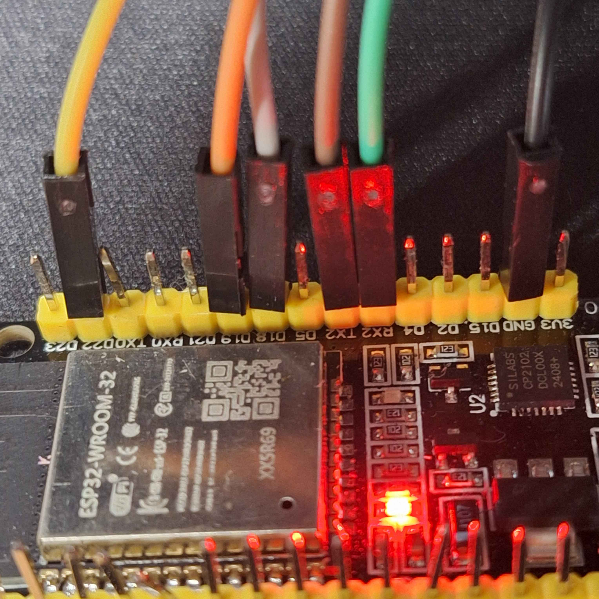
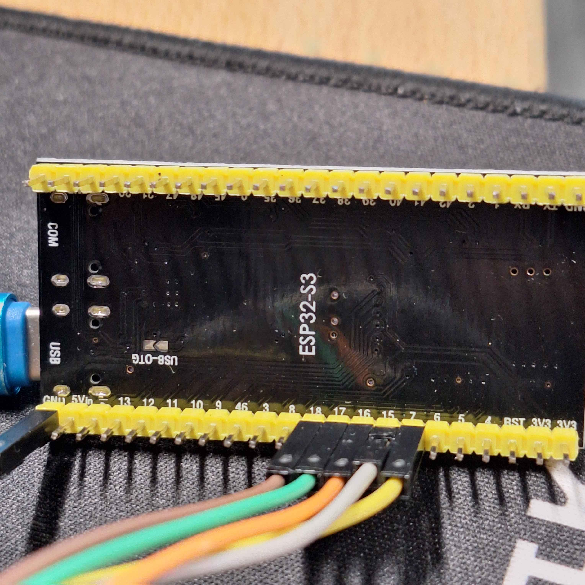

# ESP32 Audio Project
[](https://github.com/ekkus93/esp32_btaudio/actions/workflows/ci-host-tests.yml)
[](https://github.com/ekkus93/esp32_btaudio/actions/workflows/ci-device-build.yml)
[](#code-coverage)

This project centers on two ESP32 devices for an audio streaming pipeline:
- **esp_bt_audio_source** — Bluetooth A2DP audio source firmware (WROOM32 on `/dev/ttyUSB0`)
- **esp_i2s_source** — internet-radio / I2S audio provider (ESP32-S3 on `/dev/ttyACM0`)

See [`CHANGELOG.md`](CHANGELOG.md) for release history.

Protocol details, GPIO pin maps, and command references are authoritative in each
sub-project's own README/docs — see [Architecture](#architecture) below — to avoid
duplicated, drifting copies here.

## Architecture

```
  Internet ──WiFi──▶ ESP32-S3 (esp_i2s_source) ──I2S──▶ ESP32-WROOM32 (esp_bt_audio_source) ──A2DP──▶ BT speaker/earbuds
                     radio decode + resample +          bridges I2S PCM to Bluetooth,
                     web UI + station presets           commanded over UART
```

The S3 (`esp_i2s_source`) is the "brain": it fetches/decodes internet radio (or
generates a test tone), serves a web UI, and drives the WROOM32
(`esp_bt_audio_source`) over a UART control link. The WROOM32 is a focused A2DP
bridge: it takes I2S PCM in and streams it to a Bluetooth sink, with its own
serial command protocol for BT pairing/connect/volume/diagnostics.

For details, see each sub-project's own docs — they are the source of truth and
are kept current as the firmware changes:
- [`esp_bt_audio_source/README.md`](esp_bt_audio_source/README.md) — GPIO pin map, full serial command
  reference, UARTAUDIO protocol, audio source priority order.
- [`esp_i2s_source/README.md`](esp_i2s_source/README.md) and
  [`esp_i2s_source/docs/SPEC.md`](esp_i2s_source/docs/SPEC.md) — S3↔WROOM32 wiring contract, web API,
  radio/station design.

## Connecting the ESP32-S3 to the ESP32-WROOM32

The two boards are linked directly with jumper wires — I2S for audio (S3 → WROOM32)
and a UART for command/control (bidirectional). Both boards run at 3.3 V logic,
so the signal lines connect directly with no level shifting.

> **⚠️ Do not tie the two boards' 3.3V pins together.** Each board has its own
> onboard 3.3V regulator, powered from its own USB cable. Only connect **GND**
> and the specific signal pins listed below between the boards — never bridge
> the 3V3 (or 5V) power pins from one board to the other while both are
> plugged into USB. Two live regulators fighting over the same rail can damage
> one or both boards.

```
ESP32-S3 (esp_i2s_source)            ESP32-WROOM32 (esp_bt_audio_source)
GPIO15 BCLK      in  ◀────────────── GPIO18  BCLK      out  (I2S master)
GPIO16 WS/LRCLK  in  ◀────────────── GPIO19  WS/LRCLK  out
GPIO7  DOUT      out ──────────────▶ GPIO22  DIN       in
GPIO17 UART1 TX  out ──────────────▶ GPIO16  UART2 RX  in   (115200 8N1)
GPIO18 UART1 RX  in  ◀────────────── GPIO17  UART2 TX  out
GND              ◀─────────────────▶ GND
```

- The WROOM32 is the I2S **master** (generates BCLK/WS); the S3 is the I2S
  **slave transmitter**, clocking PCM data out on the WROOM32's clock.
- The UART link is the WROOM32's secondary command port (UART2) — it lets the
  S3 send BT pairing/connect/volume commands and receive events without
  competing with the WROOM32's primary USB console.
- Keep the I2S jumpers (BCLK/WS/DOUT) short and similar length — BCLK runs at
  ~2.8 MHz and long/mismatched leads can introduce enough skew to break sync.

| WROOM32 side | S3 side |
|---|---|
|  |  |

The full electrical contract — slot format, clock source rationale, and why the
WROOM32/S3 I2S roles are inverted from the "obvious" assignment — is in
[`esp_i2s_source/docs/SPEC.md`](esp_i2s_source/docs/SPEC.md) §3.

## Running Unity Firmware Tests

The on-device Unity suites live in `esp_bt_audio_source/test/test_bluetooth`
(46 tests, BT/pairing/command coverage), `esp_bt_audio_source/test/test_app_audio`
(35 tests) and `esp_bt_audio_source/test/test_manager` (18 tests). The DUT is
assumed to be connected at `/dev/ttyUSB0` unless stated otherwise. Flashing a
test image replaces the production firmware — reflash production afterwards.

1. Ensure the ESP-IDF environment is active:
  ```bash
  . "$HOME/esp/v5.5.1/esp-idf/export.sh"
  ```
2. Run one suite with the non-interactive Unity runner (builds, flashes,
   monitors, auto-stops on the Unity summary, saves
   `<suite>/build/one_run_unity.log`):
  ```bash
  cd esp_bt_audio_source
  . ../.venv/bin/activate && python tools/run_unity.py -p /dev/ttyUSB0 -r test/test_bluetooth
  ```
3. Exit code `0` = all passed; the runner prints an `N/N passed` summary and
   the saved log holds the full Unity output for failure context.

### One-command regression sweep

Use `tools/run_all_tests.py` from the repository root to execute host CTest plus all three Unity suites with fresh builds, SPIFFS flashing, and log aggregation:

```bash
. .venv/bin/activate
python tools/run_all_tests.py --port /dev/ttyUSB0 --timeout 300
```

Outputs:
- Host summary: `tmp/host_ctest_output.log`
- Unity logs: `esp_bt_audio_source/test_app*/build/one_run_unity.log`
- Aggregated counts: `tmp/run_all_tests_summary.json` (authoritative totals) and `tmp/canonical_unity_summary.json`

The script cleans prior artifacts before each run and reports pass/fail counts for every suite. Update the `--port` or `--timeout` arguments if you are using a different device path or need longer runs. Pass `--no-device` to run only the host suite (no hardware required).

## Code Coverage

The project maintains **78.1% line coverage** across production code, measured using gcov/lcov. Coverage reports are automatically generated in CI and can be generated locally.

### Generate Coverage Report Locally

```bash
# Run tests with coverage enabled
. .venv/bin/activate
python tools/run_all_tests.py --no-device --coverage --no-standalone

# View HTML report
xdg-open tmp/coverage_html/index.html
```

### Coverage Details

The coverage report includes:
- **Line coverage** across all production components
- Excludes: test code, mocks, system headers, build artifacts
- Components covered: audio_processor, bt_manager, command_interface, nvs_storage, platform_shim, util_safe

### CI Coverage Checks

GitHub Actions automatically:
- Runs coverage analysis on every pull request
- Comments coverage percentage on PRs
- Uploads detailed HTML reports as artifacts
- Prevents coverage regressions through visibility

For detailed coverage analysis, download the HTML report artifact from the CI run.

## Troubleshooting Guide

### No Sound Output
- Check I2S connections between the two ESP32s (see `esp_i2s_source/docs/SPEC.md` §3 for the wiring contract)
- Verify Bluetooth connection status (`STATUS` / `DIAG` commands on the WROOM32)
- Ensure volume is not set to zero (there are two volume stages — see `esp_i2s_source/README.md` "Volume — two stages")
- Check the sample rate configuration (`SAMPLE_RATE` command)

### ESP32s Not Communicating (UART control link)
- Verify UART wiring — TX/RX must be crossed (TX to RX, RX to TX)
- Check ground connection between the two ESP32s
- Confirm both sides agree on baud rate (115200 8N1 for the command link)

### Bluetooth Not Connecting
- Ensure the target device is in pairing mode
- Try resetting the Bluetooth stack with the `RESET` command
- Check the MAC address is entered correctly
- Try removing paired devices with `UNPAIR_ALL`

### WiFi Connection Issues (esp_i2s_source)
- Check SSID and password
- Ensure the router is broadcasting a 2.4GHz network (ESP32 doesn't support 5GHz)
- Try moving closer to the router
- Restart the device

## Developer tools

A small helper script is available to post-process pairing serial logs and resolve ELF addresses to symbols:

- Script: `tools/symbolize_pairing/symbolize_pairing.py` — extracts addresses from `build/pairing_e2_logs/serial.log` and uses `addr2line` with the built ELF to produce either a symbolized timeline or an aggregated CSV (address,count,symbol).

Example (sorted top 20):
```bash
python3 tools/symbolize_pairing/symbolize_pairing.py \
  --log esp_bt_audio_source/build/pairing_e2_logs/serial.log \
  --elf esp_bt_audio_source/build/esp_bt_audio_source.elf \
  --csv /tmp/pairing_addrs_sorted.csv --sort --top 20
```

Set `ADDR2LINE` env var if your toolchain's `addr2line` is not on PATH.

Tip: use `--no-resolve` to skip addr2line lookups when you only need address counts quickly; the symbol column will contain `<no-resolve>`.

## Running host Unity tests (Linux)

Host-side Unity tests live under `esp_bt_audio_source/test/host_test`. They build a native Linux runner with mocks so you can exercise the business logic without flashing hardware. Use the flow below whenever you need a clean run:

1. Install prerequisites (if you have not already):
  ```bash
  sudo apt-get update
  sudo apt-get install -y build-essential cmake pkg-config
  ```
2. Configure a fresh build directory:
  ```bash
  cd esp_bt_audio_source/test/host_test
  rm -rf build_host_tests
  mkdir build_host_tests && cd build_host_tests
  cmake ..
  ```
3. Build every host-test binary so they register with CTest:
  ```bash
  cmake --build . -j"$(nproc)"
  ```
4. Run the complete Unity suite and show detailed output on failure (tests are deduplicated by CTest):
  ```bash
  ctest --output-on-failure | tee test_results.log
  ```
5. To confirm coverage, list the discovered tests and compare against the Unity registrations in `test_*.c`:
  ```bash
  ctest -N
  grep -R "RUN_TEST" .. -n
  ```
6. Capture the pass/fail tally from the saved log (the final summary line from CTest is sufficient for reports):
   ```bash
   grep -E "tests (passed|failed)" test_results.log
   ```

Additional tips, including Valgrind usage and mock locations, are documented in `esp_bt_audio_source/test/host_test/README.md`.
