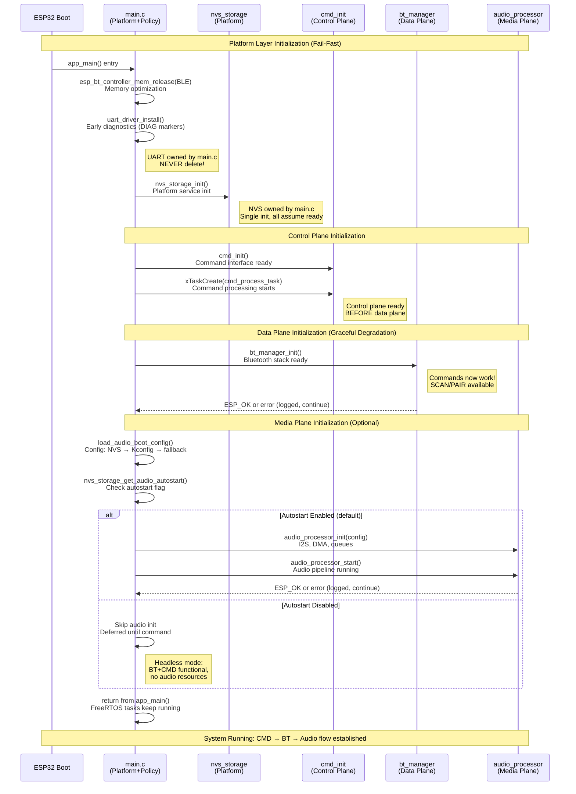
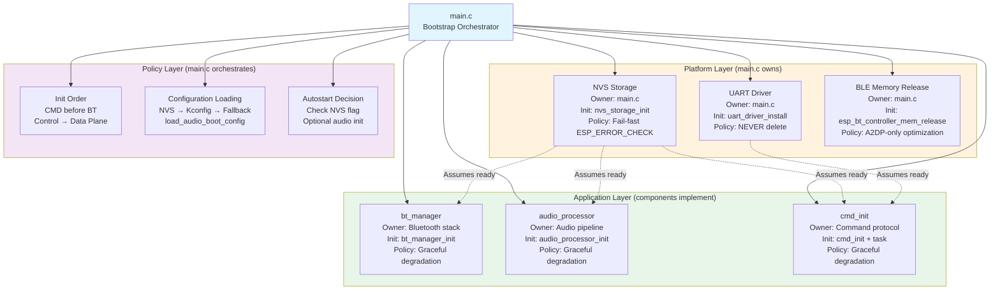
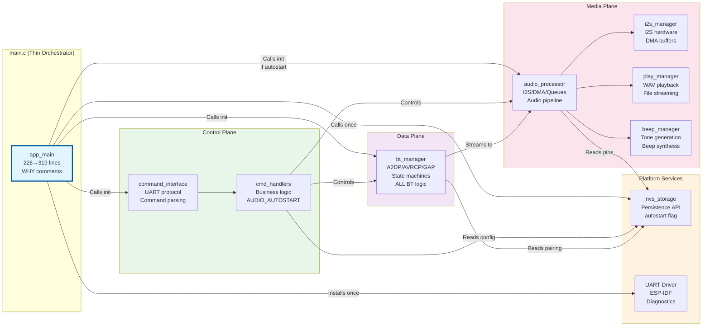
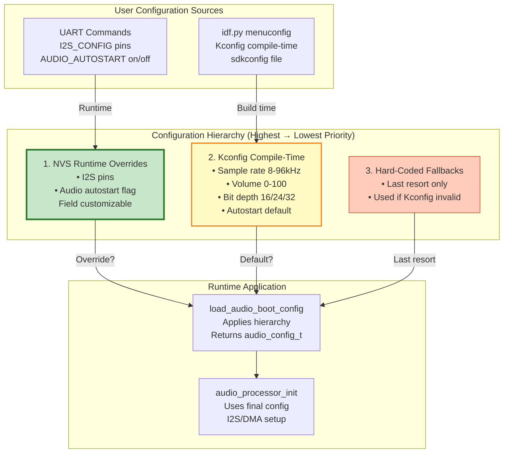
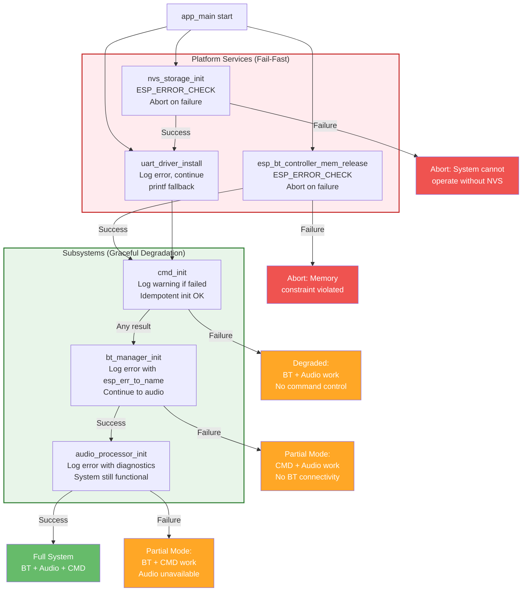
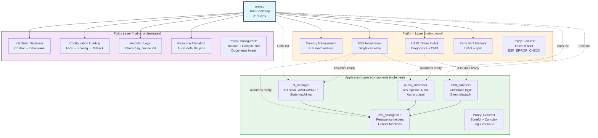
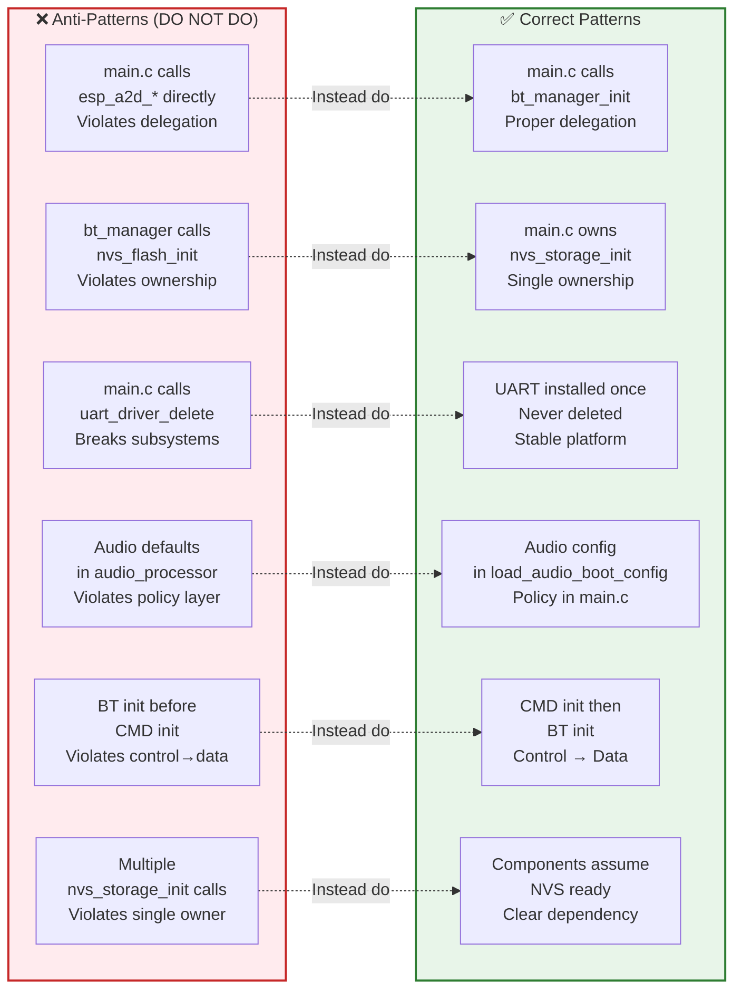

# ESP32 Bluetooth Audio Source - Architecture Diagrams

This document contains Mermaid diagrams visualizing the architecture decisions from the CODE_REVIEW2 cleanup (Jan-Feb 2026).

## Initialization Sequence

This diagram shows the boot sequence with ownership and layer separation:

## Ownership Model

This diagram shows who owns each resource:

## Component Dependencies

This diagram shows the dependency relationships between components:

## Configuration Hierarchy

This diagram shows the three-level configuration system:

## Error Handling Policy

This diagram shows the hybrid fail-fast/graceful approach:

## Layer Separation

This diagram shows the three-layer architecture:

## Anti-Patterns to Avoid

## Notes

- All diagrams reflect the architecture as of **Feb 5, 2026** (post CODE_REVIEW6 ring buffer migration)
- **Major changes since Feb 1**:
  - SPSC ring buffer architecture completed and validated (CODE_REVIEW6)
  - Legacy audio_queue removed from codebase
  - All 259 host tests passing, clang-tidy clean
  - Duplicate DIAG-EVENT prints fixed in commands.c
- See ARCH.md for detailed technical documentation
- See README.md for user-facing configuration and usage
- See memory.md for rolling engineering log (CODE_REVIEW6 completion entry)
- See code_review/CODE_REVIEW2_TODO.md for implementation history
- These diagrams are rendered by GitHub/GitLab and most Markdown viewers with Mermaid support
